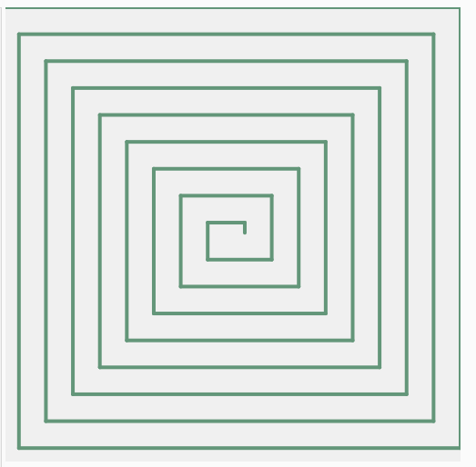
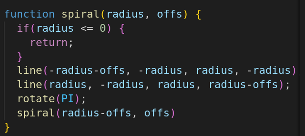

# Spirala
## Zakladni poznatky 
Abychom mohli vykreslit spiralu pomoci rekurze, musime si nejdriv vsimnout nejakeho rekurzivni vlastnosti, kterou nase spirala ma.

Dejme tomu ze prvni (nejdelsi) cara ma delku *x* a vzdalenost mezi smyckami je *o*. Pokud pujdeme postupne po jednotlivych carach vsimneme si ze jejich delka klesa timto zpusobem: *x, x-o, x-o, x-2\*o, x-2\*o, x-3\*o*...

## Rohy
Nazveme dve po sobe jdouci cary jako roh skladajici se z vertikalni (*v*) a horizontalni cary (*h*). Roh popiseme jako *(h, v)*, kde *h* reprezentuje delku horizontalni a *v* delku vertikalni cary.

Existuje zde rekurzivni vztah mezi jednotlivymi rohy (*h[n+1]=h[n]-o*, *v[n+1]=v[n]-o*). Kde pocatecni roh vypada jako (h[0]=*x*, v[0]=*x-o*).

## Rekurzivni funkce
V nasi rekurzivni funkci budeme zpracovavat jednotlive rohy. Kde nejdrive nakreslime horizontalni caru a pote vertikalni, tak aby se spojily.

Zatim, ale rohy na sudych indexech a lichych indexech se lisi v rotaci. Muzeme si vsimnout zrcadlove symetrie a pred kazdym zavolani dalsi rekurze akorat otocit platno o 180 stupnu.

## Casova komplexita
Jelikoz pri kazdem zavolanim rekurze provedem konstatni pocet operaci a funkce se vola dokud *radius* nedosahne 0, pricemz vzdy odecitame *offs*. 

Casova komplexita proto bude *O(x/offs)*, kde *x* je delka prvni cary a *offs* je vzdalenost mezi smyckami.